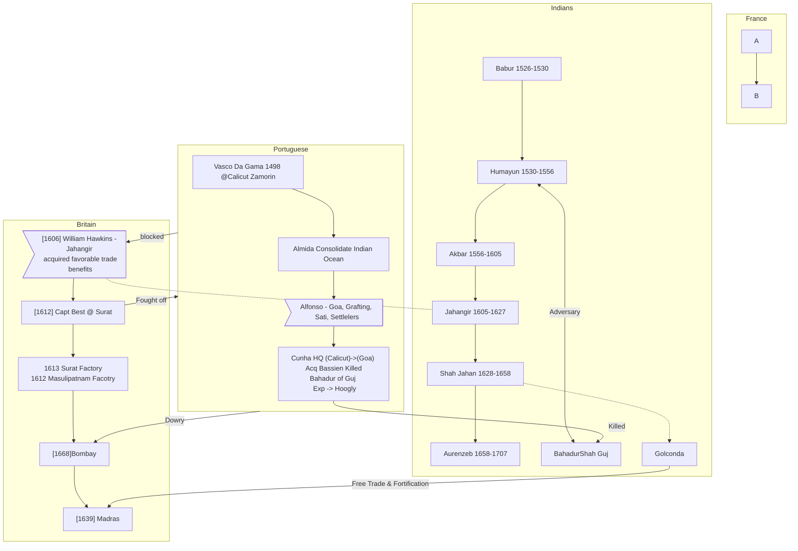

# test

<iframe src="https://www.google.com/maps/embed?pb=!1m14!1m12!1m3!1d15126.28620995241!2d73.92422475000001!3d18.59334505!2m3!1f0!2f0!3f0!3m2!1i1024!2i768!4f13.1!5e0!3m2!1sen!2sin!4v1623425458977!5m2!1sen!2sin" width="600" height="450" style="border:0;" allowfullscreen="" loading="lazy"></iframe>

# Goals and Achievements
<iframe src="https://free.timeanddate.com/countdown/i7uee0e9/n1038/cf100/cm0/cu4/ct0/cs1/ca0/co1/cr0/ss0/cacfff/cpc000/pc000/tc833891/fs100/szw192/szh81/tat26th%20Year/tacfff/tptTime%20since%20Event%20started%20in/tpc000/iso2021-06-29T16:15:00" allowtransparency="true" frameborder="0" width="192" height="81"></iframe>
<iframe src="https://free.timeanddate.com/countdown/i7uernzg/n1038/cf100/cm0/cu4/ct0/cs0/ca0/co1/cr0/ss0/cacfff/cpcfff/pc000/tcfff/fs100/szw192/szh81/tatMorgan%20Stanley/tacfff/tptTime%20since%20Event%20started%20in/tpcfff/iso2021-08-16T09:00:00" allowtransparency="true" frameborder="0" width="192" height="81"></iframe>

 

<iframe src="https://free.timeanddate.com/countdown/i7uee0e9/n1038/cf100/cm0/cu4/ct0/cs1/ca0/co1/cr0/ss0/cacfff/cpc000/pc000/tc833891/fs100/szw192/szh81/tatPrelims/tacfff/tptTime%20since%20Event%20started%20in/tpc000/iso2021-10-03T16:15:00" allowtransparency="true" frameborder="0" width="192" height="81"></iframe>

<iframe src="https://free.timeanddate.com/countdown/i7uee0e9/n1038/cf100/cm0/cu4/ct0/cs1/ca0/co1/cr0/ss0/cacfff/cpc000/pc000/tc833891/fs100/szw192/szh81/tatExpected%20Mains*/tacfff/tptTime%20since%20Event%20started%20in/tpc000/iso2022-01-02T16:15:00" allowtransparency="true" frameborder="0" width="192" height="81"></iframe>

<iframe src="https://free.timeanddate.com/countdown/i7uee0e9/n1038/cf100/cm0/cu4/ct0/cs1/ca0/co1/cr0/ss0/cacfff/cpc000/pc000/tc833891/fs100/szw192/szh81/tat27th%20Year/tacfff/tptTime%20since%20Event%20started%20in/tpc000/iso2022-06-29T16:15:00" allowtransparency="true" frameborder="0" width="192" height="81"></iframe>

2021
: Goals
    : :white_check_mark: Morgon Stanley &#8377;16LPA (&#8377;20.14LPA)

2022
: Goals
    : :red_circle: Prelims ETA `October 3, 2021`
    : :red_circle: Mains ETA `January 7, 2022`
    : :red_circle: Interview ETA `March 3, 2021`

# Investments

<iframe src="https://s.tradingview.com/embed-widget/market-overview/?locale=in#%7B%22colorTheme%22%3A%22light%22%2C%22dateRange%22%3A%2212M%22%2C%22showChart%22%3Atrue%2C%22largeChartUrl%22%3A%22%22%2C%22isTransparent%22%3Afalse%2C%22showSymbolLogo%22%3Atrue%2C%22width%22%3A%22600%22%2C%22height%22%3A%22660%22%2C%22plotLineColorGrowing%22%3A%22rgba(33%2C%20150%2C%20243%2C%201)%22%2C%22plotLineColorFalling%22%3A%22rgba(33%2C%20150%2C%20243%2C%201)%22%2C%22gridLineColor%22%3A%22rgba(240%2C%20243%2C%20250%2C%201)%22%2C%22scaleFontColor%22%3A%22rgba(120%2C%20123%2C%20134%2C%201)%22%2C%22belowLineFillColorGrowing%22%3A%22rgba(33%2C%20150%2C%20243%2C%200.12)%22%2C%22belowLineFillColorFalling%22%3A%22rgba(33%2C%20150%2C%20243%2C%200.12)%22%2C%22symbolActiveColor%22%3A%22rgba(33%2C%20150%2C%20243%2C%200.12)%22%2C%22tabs%22%3A%5B%7B%22title%22%3A%22Indices%22%2C%22symbols%22%3A%5B%7B%22s%22%3A%22FOREXCOM%3ASPXUSD%22%2C%22d%22%3A%22S%26P%20500%22%7D%2C%7B%22s%22%3A%22NSE%3ANIFTY%22%2C%22d%22%3A%22Nifty%22%7D%2C%7B%22s%22%3A%22BSE%3ASENSEX%22%2C%22d%22%3A%22Sensex%22%7D%5D%2C%22originalTitle%22%3A%22Indices%22%7D%2C%7B%22title%22%3A%22Bonds%22%2C%22symbols%22%3A%5B%7B%22s%22%3A%22BSE%3ABHRT22%22%2C%22d%22%3A%22Bharat%2022%22%7D%5D%2C%22originalTitle%22%3A%22Bonds%22%7D%2C%7B%22title%22%3A%22Stocks%22%2C%22symbols%22%3A%5B%7B%22s%22%3A%22NSE%3AHDFCBANK%22%2C%22d%22%3A%22HDFC%20Bank%20Ltd%22%7D%2C%7B%22s%22%3A%22NSE%3ABRITANNIA%22%2C%22d%22%3A%22Britannia%20Ind%20Ltd%22%7D%2C%7B%22s%22%3A%22NSE%3ABATAINDIA%22%2C%22d%22%3A%22BATA%22%7D%2C%7B%22s%22%3A%22NSE%3ARELIANCE%22%2C%22d%22%3A%22Reliance%22%7D%5D%7D%5D%2C%22utm_source%22%3A%22%22%2C%22utm_medium%22%3A%22widget_new%22%2C%22utm_campaign%22%3A%22market-overview%22%7D" style="height:100%; width:100%"></iframe>

<!-- TradingView Widget BEGIN -->

  

  
<a href="https://in.tradingview.com/markets/stocks-india/" rel="noopener" target="_blank">Stock Quotes</a> by TradingView

  

<!-- TradingView Widget END -->

